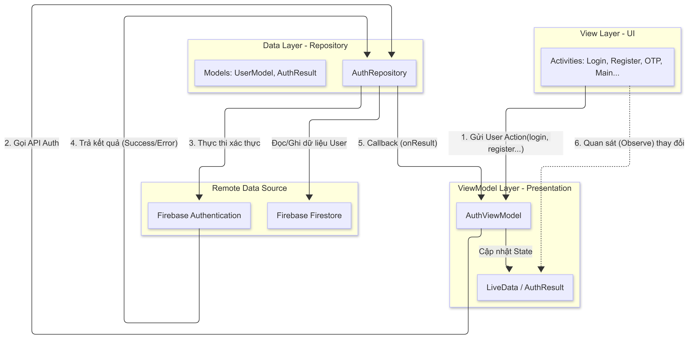
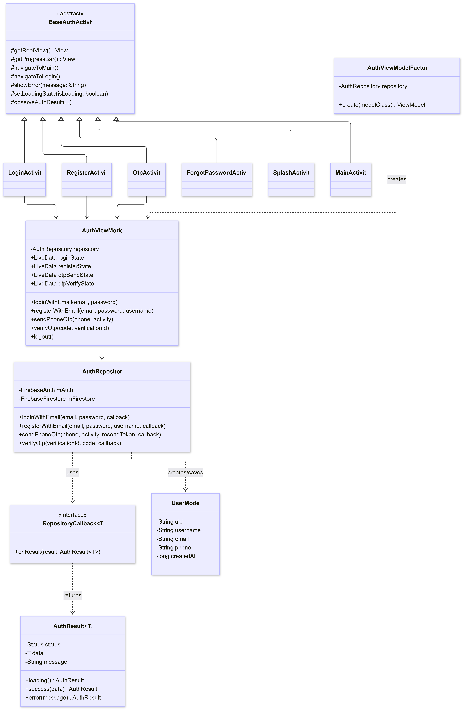

# Authentication docs

### **Author**: Gia Huy

---

## Kiến trúc



| Nguyên tắc               | Cách áp dụng                                                           |
| ------------------------ | ---------------------------------------------------------------------- |
| View không gọi Firebase  | Chỉ observe `LiveData`, delegate qua ViewModel                         |
| Repository không biết UI | Trả kết quả qua `RepositoryCallback<T>`, không nhận `LiveData`         |
| LiveData encapsulated    | ViewModel expose `LiveData` (read-only), giữ `MutableLiveData` private |
| DI qua Factory           | `AuthViewModelFactory` inject `AuthRepository` vào ViewModel           |

---

## Luồng điều hướng

```
SplashActivity
    ├─ đã login  ──► MainActivity
    └─ chưa login ──► LoginActivity
                          ├─ [Email]  ────────────────────────► MainActivity
                          ├─ [Phone]  ──► OtpActivity ────────► MainActivity
                          ├─ Quên MK  ──► ForgotPasswordActivity
                          └─ Đăng ký  ──► RegisterActivity ───► MainActivity
```

---



## Data Layer

### `AuthResult<T>` — Async result wrapper

| Factory method              | Trạng thái |
| --------------------------- | ---------- |
| `AuthResult.loading()`      | Đang xử lý |
| `AuthResult.success(data)`  | Thành công |
| `AuthResult.error(message)` | Thất bại   |

### `UserModel` — Firestore document `users/{uid}`

| Field       | Type     | Nullable           |
| ----------- | -------- | ------------------ |
| `uid`       | `String` | No                 |
| `username`  | `String` | No                 |
| `email`     | `String` | Yes (phone signup) |
| `phone`     | `String` | Yes (email signup) |
| `createdAt` | `long`   | No (Unix ms)       |

### `AuthRepository`

| Method                   | Firebase API                                       | Callback type                      |
| ------------------------ | -------------------------------------------------- | ---------------------------------- |
| `loginWithEmail`         | `signInWithEmailAndPassword`                       | `RepositoryCallback<FirebaseUser>` |
| `registerWithEmail`      | `createUserWithEmailAndPassword` → Firestore write | `RepositoryCallback<FirebaseUser>` |
| `sendPhoneOtp`           | `PhoneAuthProvider.verifyPhoneNumber`              | `RepositoryCallback<String>`       |
| `verifyOtp`              | `signInWithCredential`                             | `RepositoryCallback<FirebaseUser>` |
| `sendPasswordResetEmail` | `sendPasswordResetEmail`                           | `RepositoryCallback<Void>`         |
| `logout`                 | `signOut`                                          | —                                  |

> `sendPhoneOtp` xử lý cả gửi lần đầu và gửi lại — truyền `resendToken = null` để gửi mới, truyền token hợp lệ để resend.

### `RepositoryCallback<T>` — Interface

```java
public interface RepositoryCallback<T> {
    void onResult(AuthResult<T> result);
}
```

---

## ViewModel Layer

### `AuthViewModel`

Tạo qua `AuthViewModelFactory` (inject `AuthRepository`).

| LiveData (read-only)  | Type                       | Observer                   |
| --------------------- | -------------------------- | -------------------------- |
| `loginState`          | `AuthResult<FirebaseUser>` | LoginActivity              |
| `registerState`       | `AuthResult<FirebaseUser>` | RegisterActivity           |
| `otpSendState`        | `AuthResult<String>`       | LoginActivity, OtpActivity |
| `otpVerifyState`      | `AuthResult<FirebaseUser>` | OtpActivity                |
| `forgotPasswordState` | `AuthResult<Void>`         | ForgotPasswordActivity     |

`storedVerificationId` được giữ trong ViewModel (sống sót qua config change).

---

## View Layer

### `BaseAuthActivity` — Shared logic

Tất cả Activity kế thừa. Cung cấp:

| Method                                          | Chức năng                                   |
| ----------------------------------------------- | ------------------------------------------- |
| `navigateToMain()`                              | Chuyển sang MainActivity, clear back stack  |
| `navigateToLogin()`                             | Chuyển sang LoginActivity, clear back stack |
| `showError(message)`                            | Snackbar lỗi với fallback generic           |
| `setLoadingState(bool)`                         | Ẩn/hiện progress bar                        |
| `observeAuthResult(liveData, reset, onSuccess)` | Observer chuẩn: loading → success/error     |

### Screens

| Activity                   | Chức năng chính                                                  |
| -------------------------- | ---------------------------------------------------------------- |
| **SplashActivity**         | Delay 1.8s → route theo trạng thái login                         |
| **LoginActivity**          | Tab Email (email + password) / Tab Phone (gửi OTP → OtpActivity) |
| **RegisterActivity**       | Validate name, email, password ≥ 6, confirm match → tạo account  |
| **OtpActivity**            | 6 ô input auto-focus, countdown 60s, verify/resend OTP           |
| **ForgotPasswordActivity** | Gửi email reset → hiện success layout                            |
| **MainActivity**           | Hiện user info, nút Logout                                       |

---

## Design Tokens

| Token                  | Hex       | Dùng cho              |
| ---------------------- | --------- | --------------------- |
| `color_background`     | `#23272A` | Nền                   |
| `color_surface`        | `#2C2F33` | Card, TabLayout       |
| `color_primary`        | `#5865F2` | Nút chính, focus ring |
| `color_primary_dark`   | `#4752C4` | Pressed state         |
| `color_text_primary`   | `#FFFFFF` | Văn bản chính         |
| `color_text_secondary` | `#B9BBBE` | Label, placeholder    |
| `color_error`          | `#ED4245` | Validation error      |
| `color_success`        | `#57F287` | Thành công            |
| `color_link`           | `#00AFF4` | Link, Resend          |
