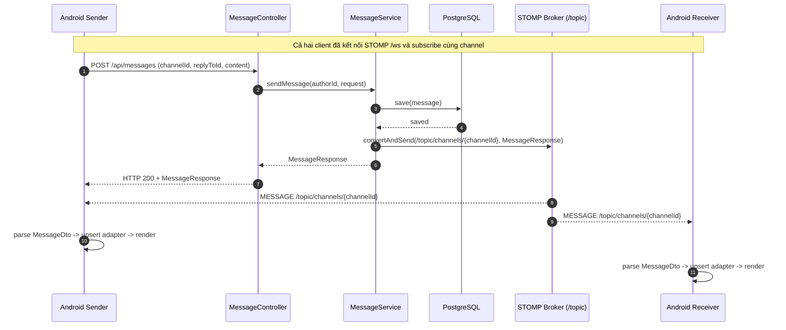

 # Luồng Gửi/Nhận Tin Nhắn Realtime - Theo Từng File

Tài liệu này chỉ tập trung vào luồng gửi và nhận tin nhắn realtime của tính năng chat DM.

Phạm vi tài liệu:
- Có: gửi tin nhắn mới và nhận tin nhắn realtime để hiển thị.
- Không có: edit, unsend, typing, các tính năng ngoài nhắn tin realtime.

## 1) Tóm tắt kiến trúc luồng realtime

- Android gửi tin nhắn mới qua HTTP `POST /api/messages`.
- Backend lưu DB xong thì broadcast realtime qua STOMP topic `/topic/channels/{channelId}`.
- Các client Android đang subscribe topic này sẽ nhận payload và cập nhật RecyclerView.

Nói ngắn gọn: REST để ghi dữ liệu, STOMP/WebSocket để đồng bộ realtime.

## 2) Luồng dữ liệu qua từng file (đúng thứ tự runtime)

### Bước A - Android tạo request gửi tin nhắn

1. `android/app/src/main/java/com/example/hubble/view/dm/DmChatActivity.java`
- Người dùng bấm nút gửi (`btnSend`) -> gọi `attemptSendMessage()`.
- Hàm này kiểm tra dữ liệu đầu vào (nội dung không rỗng, có `channelId`).
- Nếu hợp lệ, gọi `sendMessage(content, replyToId)` trong cùng Activity.
- `sendMessage(...)` chuyển việc gọi mạng sang `DmRepository`.

2. `android/app/src/main/java/com/example/hubble/data/repository/DmRepository.java`
- Nhận `channelId`, `replyToId`, `content` từ Activity.
- Tạo `CreateMessageRequest` để đóng gói payload.
- Lấy access token từ `TokenManager`, thêm vào header `Authorization`.
- Gọi Retrofit API `sendMessage(...)` bất đồng bộ và trả callback về Activity.

3. `android/app/src/main/java/com/example/hubble/data/api/ApiService.java`
- Định nghĩa endpoint HTTP cho gửi tin nhắn:
  - `POST /api/messages`
- Định nghĩa kiểu body request và response để Retrofit serialize/deserialize.

4. `android/app/src/main/java/com/example/hubble/data/model/dm/CreateMessageRequest.java`
- Chứa dữ liệu gửi lên server: `channelId`, `replyToId`, `content`.

### Bước B - Backend xử lý gửi tin nhắn và lưu DB

5. `backend/src/main/java/com/hubble/controller/MessageController.java`
- Nhận HTTP request ở `POST /api/messages`.
- Lấy người dùng hiện tại từ `@AuthenticationPrincipal`.
- Chuyển dữ liệu vào `messageService.sendMessage(...)`.
- Trả `ApiResponse<MessageResponse>` về Android sender.

6. `backend/src/main/java/com/hubble/service/MessageService.java`
- Kiểm tra `channelId` có tồn tại.
- Tạo entity `Message` từ dữ liệu request + `authorId`.
- Lưu xuống DB qua `messageRepository.save(...)`.
- Map entity sang DTO `MessageResponse`.
- Broadcast realtime bằng `messagingTemplate.convertAndSend(...)` tới:
  - `/topic/channels/{channelId}`

7. `backend/src/main/java/com/hubble/entity/Message.java`
- Định nghĩa cấu trúc bản ghi tin nhắn trong bảng `messages`.
- Giá trị `createdAt` được gán khi lưu mới (`@PrePersist`).

8. `backend/src/main/java/com/hubble/repository/MessageRepository.java`
- Thực hiện thao tác lưu bản ghi tin nhắn vào DB.

9. `backend/src/main/java/com/hubble/repository/ChannelRepository.java`
- Dùng để kiểm tra channel tồn tại trước khi lưu tin nhắn.

10. `backend/src/main/java/com/hubble/mapper/MessageMapper.java`
- Chuyển đổi `Message` entity thành `MessageResponse` để:
  - trả HTTP response cho sender
  - dùng làm payload broadcast realtime

11. `backend/src/main/java/com/hubble/dto/response/MessageResponse.java`
- DTO payload chuẩn mà backend gửi ra cho client.

### Bước C - Backend mở hạ tầng realtime

12. `backend/src/main/java/com/hubble/configuration/WebSocketConfig.java`
- Khai báo STOMP endpoint: `/ws`.
- Bật simple broker với prefix topic: `/topic`.
- Đặt application destination prefix: `/app`.

### Bước D - Android nhận realtime và cập nhật UI

13. `android/app/src/main/java/com/example/hubble/view/dm/DmChatActivity.java`
- Lifecycle kết nối:
  - `onStart()` gọi `connectStomp()` để mở kết nối realtime.
  - `onStop()` gọi `disconnectStomp()` để ngắt kết nối, tránh leak/subscription cũ.
- Cách dựng endpoint WebSocket:
  - `connectStomp()` lấy `BuildConfig.BASE_URL`, đổi `http -> ws`, `https -> wss`, rồi nối thêm `ws`.
  - Ví dụ: `http://10.0.2.2:8080/` -> `ws://10.0.2.2:8080/ws`.
- Tại sao phải đổi protocol + thêm `/ws`:
  - `BASE_URL` đang phục vụ REST (HTTP/HTTPS), còn STOMP realtime cần WebSocket URL (`ws/wss`).
  - Nếu không đổi `http/https` sang `ws/wss`, client sẽ không mở đúng kết nối WebSocket.
  - Backend đã khai báo STOMP endpoint tại `/ws` trong `WebSocketConfig`, nên client bắt buộc connect đúng path này.
  - Dùng cách suy ra từ `BASE_URL` giúp đồng bộ cấu hình theo môi trường (dev/staging/prod), tránh hard-code nhiều host.
  - Quy ước bảo mật tương ứng: `http -> ws`, `https -> wss` để nhất quán với TLS của môi trường đang chạy.
- Trình tự subscribe:
  - Activity lắng nghe `stompClient.lifecycle()`.
  - Chỉ khi event `OPENED` mới gọi `subscribeToChannel()`.
  - `subscribeToChannel()` subscribe topic `/topic/channels/{channelId}`.
- Xử lý payload realtime:
  - Mỗi message STOMP trả về `payload` dạng JSON string.
  - Payload được parse bằng Gson thành `MessageDto`.
  - Sau đó gọi `appendOrUpdateMessage(dto)` để đẩy vào luồng render UI.
- Mapping sang model hiển thị:
  - `appendOrUpdateMessage()` gọi `mapMessage(dto)` để tạo `DmMessageItem`.
  - Xác định `mine` dựa trên `authorId == currentUserId`.
  - Convert `createdAt` sang giờ hiển thị (`HH:mm`), set cờ `edited/deleted`.
  - Nếu có `replyToId`, Activity tìm item gốc trong adapter để dựng preview reply.
- Cập nhật RecyclerView:
  - `adapter.upsertItem(item)` thực hiện insert/update theo `id`.
  - Sau khi upsert, scroll xuống cuối để thấy tin nhắn mới nhất.

14. `android/app/src/main/java/com/example/hubble/data/model/dm/MessageDto.java`
- Mô hình dữ liệu tin nhắn phía Android khi nhận từ:
  - HTTP response của gửi tin nhắn
  - STOMP realtime payload
- Là "raw DTO" từ backend, gồm các field chính: `id`, `authorId`, `replyToId`, `content`, `isDeleted`, `editedAt`, `createdAt`.
- Dùng chung cho cả 2 đường dữ liệu (REST + realtime) để UI xử lý thống nhất.

15. `android/app/src/main/java/com/example/hubble/data/model/dm/DmMessageItem.java`
- Model hiển thị trong UI (RecyclerView item).
- Được tạo ra từ `MessageDto` sau khi map dữ liệu.
- Chứa thêm thông tin phục vụ render mà DTO không có trực tiếp:
  - `senderName` để hiện tên thân thiện.
  - `timestamp` đã format.
  - `mine` để phân biệt tin nhắn của mình/đối phương.
  - `replyToSenderName`, `replyToContent` cho khối quote reply.

16. `android/app/src/main/java/com/example/hubble/adapter/dm/DmMessageAdapter.java`
- Chịu trách nhiệm render danh sách tin nhắn.
- Dùng `upsertItem(...)` để:
  - nếu id đã tồn tại -> cập nhật item cũ
  - nếu id chưa có -> thêm item mới
- Cơ chế này giúp tránh trùng khi sender vừa nhận HTTP response vừa nhận broadcast realtime.
- Chi tiết chống trùng:
  - Sender thường nhận cùng 1 tin qua 2 nguồn: callback HTTP và STOMP broadcast.
  - Cả hai đều đi qua `appendOrUpdateMessage()` -> `upsertItem()`.
  - Vì key là `message id`, adapter chỉ giữ 1 bản ghi duy nhất cho mỗi tin nhắn.
- Khi `item.isDeleted() == true`, adapter remove item khỏi list thay vì hiển thị như tin mới.

Kết luận ngắn của Bước D:
- Android coi STOMP message như "nguồn đồng bộ realtime".
- Mọi payload (dù đến từ HTTP hay STOMP) đều được chuẩn hóa về `MessageDto` -> `DmMessageItem` -> `upsert`.
- Nhờ vậy UI ổn định, realtime mượt và không bị duplicate tin nhắn.

## 3) Pipeline một dòng

`DmChatActivity` -> `DmRepository` -> `ApiService` -> `MessageController` -> `MessageService` -> `MessageRepository` (DB) -> `SimpMessagingTemplate` broadcast `/topic/channels/{channelId}` -> `DmChatActivity` subscriber -> `DmMessageAdapter` -> RecyclerView.

## 4) Sơ đồ tuần tự (chỉ luồng gửi/nhận realtime)

